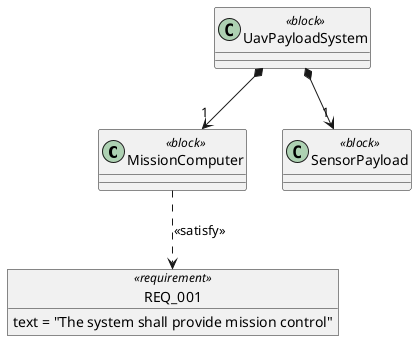
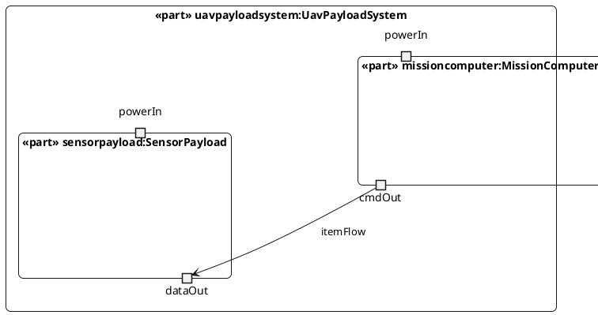

This skill provides comprehensive SysML v2 (Systems Modeling Language version 2) capabilities for authoring, parsing, validating, transforming, and visualizing system models using production-grade implementation.

## Core Capabilities Summary

1. **Generate SysML v2** - Convert IR or plain language to valid .sysml with public visibility and port typing
2. **Parse SysML v2** - Parse .sysml to IR with namespace import resolution (::*, ::**, ::*::**)
3. **Validate** - Syntax, semantic, and style validation with error reporting
4. **Render PlantUML** - Generate BDD/IBD diagrams with view filtering
5. **Convert Formats** - Bidirectional IR ↔ .sysml transformation
6. **Export XMI** - Generate Eclipse EMF-compatible XMI for tool interoperability

## 1. Generate Valid SysML v2 (.sysml files)

Convert plain language descriptions or IR dictionaries into fully compliant SysML v2 textual syntax.

**Key Features:**
- Public visibility keywords (`public part def`, `public requirement`, `public port def`)
- Strict port typing - all ports have types (`port name : PortType`)
- ScalarValues import for standard types (`Real`, `String`, `Integer`)
- Proper multiplicity syntax (`[1]`, `[4]`, `[1..*]`, `[*]`)
- Requirements with doc strings
- Satisfy relationships for traceability
- Named connections between parts

**Implementation:** `lib/sysml_generator.py`

**Complete Example:**
```sysml
package arch_000001 {

    import ScalarValues::*;

    // UAV Payload System Architecture
    // Domain: aerospace

    // Requirements
    public requirement REQ_001 {
        doc "The system shall provide mission control"
    }

    public requirement REQ_002 {
        doc "The system shall process sensor data in real-time"
    }

    // Port Definitions
    public port def CommandIF;
    public port def DataIF;
    public port def PowerIF;

    // Component Definitions
    public part def MissionComputer {
        attribute processingPower : Real [1];
        attribute memorySize : Real [1];
        port cmdOut : CommandIF;
        port powerIn : PowerIF;
    }

    public part def SensorPayload {
        attribute dataRate : Real [1];
        attribute resolution : Real [1];
        port dataOut : DataIF;
        port powerIn : PowerIF;
    }

    // System Definition
    public part def UavPayloadSystem {
        part missioncomputer : MissionComputer {
            satisfy REQ_001;
        }
        part sensorpayload : SensorPayload {
            satisfy REQ_002;
        }

        // Connections
        connect missioncomputer.cmdOut to sensorpayload.dataOut;
    }

    // System Instance
    public part uavpayloadsystem : UavPayloadSystem;

}
```

**Naming Conventions:**
- Types: PascalCase (e.g., `MissionComputer`, `PowerIF`)
- Instances: camelCase/lowercase (e.g., `missioncomputer`, `sensorpayload`)
- Requirements: UPPER_CASE (e.g., `REQ_001`, `PERF_100`)
- Port names: camelCase (e.g., `cmdOut`, `powerIn`)

**Multiplicity Patterns:**
- Single instance: `part battery : Battery;` (implicit `[1]`)
- Explicit single: `part battery : Battery[1];`
- Multiple identical: `part sensors : Sensor[8];`
- Range: `part batteries : Battery[4..12];`
- Unbounded: `part cells : BatteryCell[*];`

**Connection Patterns:**
```sysml
// Port-to-port (most common)
connect componentA.portOut to componentB.portIn;

// Part-to-part (delegates to component interfaces)
connect componentA to componentB;

// Self-connection (feedback loop)
connect controller.output to controller.input;

// One-to-many (all instances)
part sensors : Sensor[8];
connect powerBus.powerOut to sensors.powerIn;  // Connects to ALL 8
```

**When to Use Individual Instances vs Multiplicity:**

Use **multiplicity** when:
- All instances are identical
- One source connects to all instances uniformly
- Example: `part sensors : Sensor[8]; connect bus.power to sensors.powerIn;`

Use **individual instances** when:
- Different sources connect to different instances
- Need to distinguish between instances (left/right, front/back)
- Example:
```sysml
part wheelFrontLeft : Wheel;
part wheelFrontRight : Wheel;
part wheelRearLeft : Wheel;
part wheelRearRight : Wheel;

connect differential.leftOut to wheelRearLeft.axleMount;
connect differential.rightOut to wheelRearRight.axleMount;
```

## 2. Parse SysML v2 with Import Resolution

Parse .sysml textual syntax back to IR with full support for namespace imports.

**Key Features:**
- Handles `public` visibility keywords
- Resolves namespace imports with pattern matching
- Supports file-based imports (`import "model.sysml";`)
- Supports namespace imports (`import PackageName::*;`)
- Validates package structure
- Extracts exposed elements for view filtering

**Implementation:** `spa/sysml_parser.py`

**Namespace Import Patterns:**

1. **Direct members only** (`::*`):
```sysml
import Systems::*;
// Imports: PowerSystem, CoolingSystem (top-level only)
// Does NOT import: battery, radiator (nested elements)
```

2. **Recursive nested only** (`::**`):
```sysml
import Systems::**;
// Imports: battery, radiator (nested elements recursively)
// Does NOT import: PowerSystem, CoolingSystem (top-level)
```

3. **Hybrid - all elements** (`::*::**`):
```sysml
import Systems::*::**;
// Imports: PowerSystem, CoolingSystem (direct) + battery, radiator (nested)
```

**File-Based Imports:**
```sysml
// In views/bdd.sysml
package arch_000001_bdd {
    import "model.sysml";  // Relative to view file location
    
    /* @viewType: BlockDefinitionDiagram */
    /* @showPorts: false */
}
```

**Parser Functions:**
- `parse_sysml_to_json(content, file_path)` - Main parser entry point
- `load_with_imports(file_path)` - Recursive import loader
- `parse_namespace_import(line)` - Extract namespace import pattern
- `resolve_namespace_import(package, pattern, arch)` - Resolve visible elements
- `merge_architectures(base, override)` - Merge imported content

## 3. Validate SysML v2 Syntax and Semantics

Comprehensive validation with three severity levels: ERROR, WARNING, INFO.

**Implementation:** `tests/test_sysml_validation.py`

**Validation Categories:**

### Syntax Validation
- Package declaration presence and format
- Brace balancing
- Semicolon placement
- Port declaration syntax (type required)
- Requirement format (`doc` statement required)
- Connection statement format
- Multiplicity expression syntax

### Semantic Validation
- Undefined part references in connections
- Undefined port references
- Undefined requirement references in satisfy statements
- Duplicate definitions (case-insensitive)
- Circular composition dependencies
- Port ownership verification

### Style Validation
- Naming conventions (PascalCase types, camelCase instances)
- Indentation consistency (4-space multiples)
- Documentation presence

**Usage Example:**
```python
from tests.test_sysml_validation import SysMLValidator
from pathlib import Path

validator = SysMLValidator()
issues = validator.validate_file(Path('model.sysml'))

for issue in issues:
    print(issue)  # [ERROR] UndefinedReference: Port 'cmdOut' not found on 'Computer' (line 42)
```

**Validation from Server API:**
```python
from spa.server import validate_sysml_content

result = validate_sysml_content(sysml_text)
# Returns: {'valid': bool, 'errors': [...]}
```

**Common Errors:**

ERROR - **Missing package declaration**
```
Invalid SysML v2 syntax: missing package declaration. Expected 'package <name> { ... }'
```

ERROR - **Untyped port** (caught as warning)
```
Port 'cmdOut' has no type declaration
```

ERROR - **Undefined reference**
```
Connection target references undefined port 'dataIn' on 'Sensor'
```

ERROR - **Malformed requirement**
```
Requirement 'REQ_001' missing doc statement
```

## 4. Render PlantUML Diagrams with View Filtering

Generate Block Definition Diagrams (BDD) and Internal Block Diagrams (IBD) from .sysml with support for view filtering.

**Implementation:** `spa/server.py`
- `generate_bdd_plantuml(sysml_path)` - Line 299
- `generate_ibd_plantuml(sysml_path)` - Line 382

**Key Features:**
- View filtering based on `public` keywords
- Composition relationship rendering
- Requirement visualization
- Satisfy relationship tracing
- Port rendering with type information
- Nested component structure

### Block Definition Diagram (BDD)

Shows static structure: blocks, compositions, requirements, satisfy relationships.

**Generated PlantUML:**


**Key Patterns:**
- Blocks: `class BlockName <<block>>`
- Composition: `Parent *--> "multiplicity" Child`
- Requirements: `object "REQ-ID" as REQ_ID <<requirement>> { text = "..." }`
- Satisfy: `Block ..> REQ_ID : <<satisfy>>`

### Internal Block Diagram (IBD)

Shows internal structure: nested components, ports, connections.

**Generated PlantUML:**


**Key Patterns:**
- Nested components: `component "«part» name:Type" as ALIAS { ... }`
- Ports: `portin "name" as ALIAS_PORTNAME`
- Connections: `ALIAS_A --> ALIAS_B : «itemFlow»`

### View Filtering

Only elements marked `public` appear in diagrams.

**Model (model.sysml):**
```sysml
package arch_000001 {
    public part def VisibleComponent { }
    part def HiddenComponent { }  // No 'public' keyword
}
```

**Result:** Only `VisibleComponent` appears in BDD/IBD.

**Backward Compatibility:** If NO elements are marked public, all elements are shown.

## 5. Convert Between IR and .sysml Formats

Bidirectional transformation between JSON IR (intermediate representation) and SysML v2 textual syntax.

**IR → .sysml:** `lib/sysml_generator.py::generate_sysml_from_dict(arch)`

**IR Structure:**
```python
{
    'id': 'arch_000001',
    'name': 'UAV Payload System',
    'domain': 'aerospace',
    'format': 'sysml_v2_textual',
    'blocks': [
        {'name': 'UavPayloadSystem', 'stereotype': 'Block'},
        {'name': 'MissionComputer', 'stereotype': 'Block'},
    ],
    'proxy_ports': [
        {'owner': 'MissionComputer', 'name': 'cmdOut', 'type': 'CommandIF'},
    ],
    'connectors': [
        {'name': 'conn_001', 'end_a': 'MissionComputer.cmdOut',
         'end_b': 'SensorPayload.dataOut', 'item_flow': ''},
    ],
    'requirements': [
        {'id': 'REQ_001', 'text': 'The system shall...'},
    ],
    'relationships': [
        {'type': 'satisfy', 'client': 'MissionComputer', 'supplier': 'REQ_001'},
    ],
    'compositions': [
        {'parent': 'UavPayloadSystem', 'child': 'MissionComputer', 'multiplicity': '1'}
    ],
    'exposed_elements': ['UavPayloadSystem', 'MissionComputer'],  # public elements
    'namespace_imports': [
        {'package': 'ScalarValues', 'pattern': 'direct'}
    ]
}
```

**.sysml → IR:** `spa/sysml_parser.py::parse_sysml_to_json(content, file_path)`

**Transformation guarantees:**
- Round-trip fidelity: IR → .sysml → IR preserves semantic content
- Port types always included
- Public visibility tracked in `exposed_elements`
- Compositions extracted from part definitions
- Instance names mapped to type names in connections

## 6. Export XMI for Tool Interoperability

Generate Eclipse EMF-compatible XMI for import into commercial tools (MagicDraw, Cameo, Capella).

**Implementation:** `lib/xmi_generator.py`

**XMI Structure:**
```xml
<?xml version="1.0" encoding="UTF-8"?>
<xmi:XMI xmi:version="2.0" xmlns:xmi="http://www.omg.org/XMI" xmlns:sysml="http://www.omg.org/spec/SysML/2.0">
  <sysml:Package xmi:id="pkg_arch_000001" name="arch_000001">
    <ownedElement xmi:type="sysml:PartDefinition" xmi:id="part_MissionComputer" name="MissionComputer">
      <ownedPort xmi:id="port_MissionComputer_cmdOut" name="cmdOut" type="CommandIF"/>
    </ownedElement>
    <ownedElement xmi:type="sysml:Requirement" xmi:id="req_REQ_001" name="REQ_001">
      <text>The system shall provide mission control</text>
    </ownedElement>
  </sysml:Package>
</xmi:XMI>
```

**Use Cases:**
- Import into MagicDraw/Cameo Systems Modeler
- Migrate to SysML v1.x tools via OMG transformation spec
- Exchange models with other teams
- Archive in model repositories

## Implementation Architecture

### Key Files

**Generation:**
- `lib/sysml_generator.py` - IR → .sysml conversion with public keywords
- `lib/xmi_generator.py` - IR → XMI export

**Parsing:**
- `spa/sysml_parser.py` - .sysml → IR with namespace import resolution
  - `parse_sysml_to_json()` - Main entry point
  - `parse_namespace_import()` - Import pattern extraction
  - `load_with_imports()` - Recursive import loader

**Validation:**
- `tests/test_sysml_validation.py` - Comprehensive validator
  - `SysMLValidator` class with syntax/semantic/style checks
  - `ValidationError` with severity levels

**Rendering:**
- `spa/server.py` - PlantUML generation with view filtering
  - `generate_bdd_plantuml()` - Block Definition Diagrams
  - `generate_ibd_plantuml()` - Internal Block Diagrams
  - `validate_sysml_content()` - Validation API

**Sample Architectures:**
- `data/architectures/*.sysml` - 200+ generated architectures
- `data/architectures/car_system.sysml` - Reference electric vehicle model

### Architecture Pipeline

```
Plain Language
    ↓
[Generator] lib/sysml_generator.py
    ↓
.sysml File (with public keywords)
    ↓
[Parser] spa/sysml_parser.py (with import resolution)
    ↓
JSON IR (with exposed_elements)
    ↓
┌───────────┬──────────────┬──────────────┐
↓           ↓              ↓              ↓
[Validator] [PlantUML BDD] [PlantUML IBD] [XMI Export]
test_*.py   server.py      server.py      xmi_generator.py
```

## Usage Examples

### Example 1: Generate .sysml from Plain Language

**User Request:** "Create a satellite system with a flight computer and solar panels. The computer receives power from the panels."

**Generated .sysml:**
```sysml
package satellite_system {

    import ScalarValues::*;

    // Satellite Power System
    // Domain: aerospace

    public port def PowerIF;
    public port def ControlIF;

    public part def FlightComputer {
        attribute processingPower : Real [1];
        attribute memorySize : Real [1];
        port powerIn : PowerIF;
        port ctrlOut : ControlIF;
    }

    public part def SolarPanel {
        attribute power : Real [1];
        port powerOut : PowerIF;
    }

    public part def SatelliteSystem {
        part flightcomputer : FlightComputer;
        part solarpanel : SolarPanel;

        connect solarpanel.powerOut to flightcomputer.powerIn;
    }

    public part satellitesystem : SatelliteSystem;

}
```

### Example 2: Parse .sysml with Imports

```python
from spa.sysml_parser import load_with_imports
from pathlib import Path

# Parse view file that imports model
arch = load_with_imports(Path('data/arch_000001/views/bdd.sysml'))

print(f"Architecture: {arch['name']}")
print(f"Blocks: {[b['name'] for b in arch['blocks']]}")
print(f"Exposed: {arch['exposed_elements']}")
```

### Example 3: Validate SysML

```python
from tests.test_sysml_validation import SysMLValidator
from pathlib import Path

validator = SysMLValidator()
issues = validator.validate_file(Path('model.sysml'))

errors = [i for i in issues if i.severity.value == 'error']
warnings = [i for i in issues if i.severity.value == 'warning']

print(f"Validation: {len(errors)} errors, {len(warnings)} warnings")
for error in errors:
    print(f"  {error}")
```

### Example 4: Generate PlantUML BDD

```python
from spa.server import generate_bdd_plantuml
from pathlib import Path

plantuml = generate_bdd_plantuml(Path('data/architectures/car_system.sysml'))
print(plantuml)
# Output: PlantUML source with @startuml...@enduml
```

### Example 5: Convert IR to .sysml

```python
from lib.sysml_generator import generate_sysml_from_dict

arch_ir = {
    'id': 'example_arch',
    'name': 'Example Architecture',
    'domain': 'embedded systems',
    'blocks': [
        {'name': 'System', 'stereotype': 'Block'},
        {'name': 'Controller', 'stereotype': 'Block'}
    ],
    'proxy_ports': [
        {'owner': 'Controller', 'name': 'ctrlOut', 'type': 'ControlIF'}
    ],
    'connectors': [],
    'requirements': [
        {'id': 'REQ_001', 'text': 'The system shall operate reliably'}
    ],
    'relationships': [
        {'type': 'satisfy', 'client': 'Controller', 'supplier': 'REQ_001'}
    ]
}

sysml_text = generate_sysml_from_dict(arch_ir)
Path('output.sysml').write_text(sysml_text)
```

### Example 6: Export to XMI

```python
from lib.xmi_generator import generate_xmi
from spa.sysml_parser import parse_sysml_to_json
from pathlib import Path

# Parse .sysml to IR
content = Path('model.sysml').read_text()
arch = parse_sysml_to_json(content)

# Generate XMI
xmi_content = generate_xmi(arch)
Path('model.xmi').write_text(xmi_content)
```

## Quality Guidelines

1. **Always use public keywords** for visibility control
2. **Type all ports** - never use bare `port name;`
3. **Import ScalarValues** for standard types (Real, String, Integer)
4. **Validate before outputting** - run through validator
5. **Use consistent naming** - PascalCase types, camelCase instances
6. **Document requirements** - never empty doc strings
7. **Check connections** - verify parts and ports exist
8. **Preserve structure** when modifying existing files
9. **Use multiplicity wisely** - individual instances when needed for clarity
10. **Test round-trip** - IR → .sysml → IR should preserve semantics

## Common Patterns

### Port Type Definitions
```sysml
public port def PowerIF;
public port def ControlIF;
public port def DataIF;
public port def MechanicalIF;
public port def ThermalIF;
public port def CANBusIF;
public port def EthernetIF;
```

### Requirement with Traceability
```sysml
public requirement REQ_PERF_001 {
    doc "The system shall process 1000 commands per second"
}

public part def FlightController {
    part processor : Processor {
        satisfy REQ_PERF_001;
    }
}
```

### Bidirectional Connections
```sysml
// For bidirectional data flow, create two connections
connect computer.dataOut to sensor.dataIn;
connect sensor.dataOut to computer.dataIn;
```

### Multiplicity with Uniform Connections
```sysml
part def PowerDistribution {
    part powerBus : PowerBus;
    part sensors : Sensor[16];  // 16 identical sensors

    // This connects powerBus.powerOut to ALL 16 sensors
    connect powerBus.powerOut to sensors.powerIn;
}
```

### Self-Reference (Feedback Loop)
```sysml
part def PIDController {
    port feedback : SensorIF;
    port output : ActuatorIF;

    // Feedback loop
    connect output to feedback;
}
```

## Error Handling

**Parse Error - Missing Package:**
```
ValueError: Invalid SysML v2 syntax: missing package declaration. 
Expected 'package <name> { ... }'
```
**Fix:** Ensure first non-comment line is `package <name> {`

**Validation Error - Untyped Port:**
```
[WARNING] PortTyping: Port 'cmdOut' has no type declaration (line 15)
```
**Fix:** Change `port cmdOut;` to `port cmdOut : CommandIF;`

**Validation Error - Undefined Reference:**
```
[ERROR] UndefinedReference: Connection target references undefined port 'dataIn' on 'Sensor' (line 42)
```
**Fix:** Add `port dataIn : DataIF;` to `part def Sensor`

**Semantic Error - Circular Dependency:**
```
[ERROR] CircularDependency: Circular composition dependency detected involving 'SystemA' (line 10)
```
**Fix:** Remove circular containment - parts cannot contain themselves transitively

## Official SysML v2 References

### Specifications and Tools
- **SysML v2 Release Repository**: https://github.com/systems-modeling/sysml-v2-release
  - Complete language specification
  - Xtext grammar (textual notation)
  - Reference implementation
  - Example models

### Migration from SysML v1.x
- **SysML 2.0 Transformation Specification**: https://www.omg.org/spec/SysML/2.0/Transformation/PDF
  - OMG official migration guide
  - Mapping rules for v1.7b → v2
  - Block/port/requirement transformations
  - Use when migrating MagicDraw (.mdzip) models

### Memory References
Access detailed reference material from memory:
- `sysmlv2_syntax.md` - Official textual syntax patterns
- `sysmlv2_validation.md` - Validation approach and semantics
- `sysmlv2_multiplicity.md` - Multiplicity vs individual instances
- `emf_xmi_sysmlv2.md` - XMI format and EMF integration
- `plantuml_sysml.md` - PlantUML BDD/IBD patterns
- `plantuml_relationships.md` - Arrow syntax for relationships

## Testing

**Run MVP Checks:**
```bash
bash ralph/run_mvp_checks.sh
```

**Manual Validation:**
```bash
python -m spa.sysml_parser data/architectures/car_system.sysml
```

**Generate Sample Architectures:**
```bash
python scripts/generate_varied_architectures.py
```

## Next Steps After Using This Skill

1. **Validate generated .sysml** - Use validator to catch errors early
2. **View diagrams** - Generate PlantUML and verify structure
3. **Test parsing** - Ensure round-trip IR → .sysml → IR works
4. **Export XMI** - For integration with commercial tools
5. **Run MVP checks** - Full pipeline validation

## Limitations and Known Issues

1. **Not a full SysML v2 compiler** - Validates syntax/semantics but doesn't enforce all language constraints
2. **No KerML integration** - Does not parse/validate KerML (kernel language)
3. **Limited expression support** - No computed values or constraint expressions
4. **PlantUML limitations** - Diagram complexity bounded by PlantUML renderer capabilities
5. **XMI compatibility** - XMI is EMF-compatible but may need tool-specific adjustments

## Best Practices for This Implementation

1. **Always mark visibility** - Use `public` for exposed elements
2. **Validate early** - Run validator before committing changes
3. **Test with parser** - Verify .sysml parses back to IR correctly
4. **Use view filtering** - Separate model (model.sysml) from views (views/bdd.sysml)
5. **Document imports** - Comment why each import is needed
6. **Version control .sysml** - Track textual syntax, not binary formats
7. **Generate diagrams** - PlantUML as documentation, not source of truth
8. **Export XMI for archival** - Preserve models in tool-neutral format
