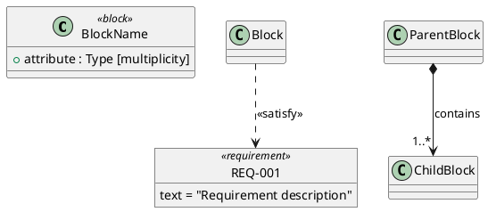
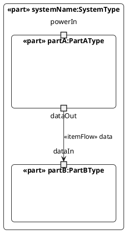

This skill helps you work with SysML v2 (Systems Modeling Language version 2) architectures. It provides capabilities for authoring, transforming, validating, and visualizing system models.

## Core Capabilities

### 1. Plain Language → .sysml File Generation
Convert natural language descriptions of systems into valid SysML v2 textual syntax.

**What to include:**
- System/subsystem structure (part definitions)
- Attributes with types and multiplicities
- Port definitions with types (PowerPort, DataPort, MechanicalPort, etc.)
- Requirements with IDs and text
- Connections between parts
- Satisfy relationships (requirements traceability)

**Syntax patterns to use:**
```sysml
package PackageName {
    // Port type definitions
    port def PowerPort;
    port def DataPort;
    
    // Part definitions
    part def ComponentName {
        attribute attrName : Real [1];
        port portName : PowerPort;
    }
    
    // Requirements
    requirement REQ_001 {
        doc "Requirement text"
    }
    
    // System definition with part properties
    part def SystemName {
        part component1 : ComponentType {
            satisfy REQ_001;
        }
        
        // Multiplicity with connections: connection applies to ALL instances
        part sensors : Sensor[8];
        connect powerBus.powerOut to sensors.powerIn;
        // UNAMBIGUOUS: powerOut connects to ALL 8 sensor instances
        
        // Individual instances: needed to avoid ambiguity when multiple 
        // source ports connect to same part type
        part wheelRearLeft : Wheel;
        part wheelRearRight : Wheel;
        // Required because: differential.leftOut → which wheel?
        //                   differential.rightOut → which wheel?
        // Individual instances eliminate ambiguity
        
        // Connections (multiple forms supported)
        connect component1.portA to component2.portB;  // Port-to-port
        connect component1 to component2;              // Part-to-part
        connect component1 to component2.portB;        // Part-to-port
        connect component1.portA to component1.portB;  // Self-connection (feedback loop)
        connect differential.leftOut to wheelFrontLeft.axleMount;
    }
    
    // Instance
    part systemInstance : SystemName;
}
```

**Key rules:**
- Use lowercase for part instances (e.g., `part batterypack : BatteryPack`)
- Use PascalCase for type names (e.g., `part def BatteryPack`)
- Port syntax: `port portName : PortType;`
- Connection syntax: `connect partA.portA to partB.portB;`
- Doc strings use double quotes: `doc "text"`
- Requirements use `satisfy REQ_XXX;` inside part instances

### 2. .sysml → PlantUML Syntax Generation
Convert SysML v2 files into PlantUML source code for Block Definition Diagrams (BDD) and Internal Block Diagrams (IBD).

**BDD Generation (Block Definition Diagram):**


**IBD Generation (Internal Block Diagram):**


**Key patterns:**
- Use `class X <<block>>` for part definitions in BDD
- Use `object "ID" as ID <<requirement>>` for requirements
- Use `*-->` for directed composition (parent contains child, shows direction)
- Use `..>` with stereotypes for trace/satisfy relationships
- Use nested `component` with real ports for IBD
- Port types: `portin`, `portout`, `port` (neutral)
- Port aliases: `COMPONENT_PORTNAME` for clean connections
- Connection syntax: `ALIAS_A --> ALIAS_B : «itemFlow» description`

### 3. Syntax Validation

**SysML v2 Validation:**
Check for:
- Valid package structure
- Proper part def vs part usage syntax
- Correct port typing (`: PortType` required)
- Valid connection syntax (`connect a.b to c.d;`)
- Requirement format (`requirement REQ_XXX { doc "text" }`)
- Satisfy statement format (`satisfy REQ_XXX;`)

**PlantUML Validation:**
Check for:
- Valid diagram delimiters (`@startuml` / `@enduml`)
- Proper stereotype syntax (`<<block>>`, `<<requirement>>`, `<<part>>`)
- Valid relationship arrows (`*--`, `..>`, `-->`, `-|>`)
- Escaped special characters in strings
- Valid skinparam settings

### 4. Add/Modify/Remove Elements

**Blocks (Part Definitions):**
```sysml
// Add
part def NewBlock {
    attribute mass : Real [1];
    port powerIn : PowerPort;
}

// Modify - add attribute
part def ExistingBlock {
    attribute mass : Real [1];
    attribute newAttr : Real [1];  // Added
}

// Remove - delete the entire part def block
```

**Requirements:**
```sysml
// Add
requirement REQ_005 {
    doc "New requirement text"
}

// Modify - change doc text
requirement REQ_001 {
    doc "Updated requirement text"
}

// Remove - delete entire requirement block
```

**Part Properties (Attributes):**
```sysml
part def Block {
    attribute existingAttr : Real [1];
    attribute newAttr : String [0..1];  // Add
    // Remove: delete attribute line
}
```

**Ports:**
```sysml
part def Block {
    port existingPort : PowerPort;
    port newPort : DataPort;  // Add
    // Remove: delete port line
}
```

**Connections:**
```sysml
part def System {
    part a : ComponentA;
    part b : ComponentB;
    
    connect a.portOut to b.portIn;  // Add
    // Remove: delete connect line
}
```

**Satisfy Relationships:**
```sysml
part def System {
    part component : ComponentType {
        satisfy REQ_001;  // Add
        // Remove: delete satisfy line
    }
}
```

## Key Files in This Project

**SysML Parsing:**
- `python_spa_adapter_ralph_loop/spa/sysml_parser.py` - Parse .sysml → JSON IR

**SysML Rendering:**
- `scripts/render_ir.py` - Render JSON IR → .sysml

**PlantUML Generation:**
- `python_spa_adapter_ralph_loop/spa/server.py`
  - `generate_bdd_plantuml()` - BDD generation (lines 56-86)
  - `generate_ibd_plantuml()` - IBD generation (lines 89-169)

**Example Architecture:**
- `python_spa_adapter_ralph_loop/data/architectures/car_system.sysml` - Complete EV system

## Multiplicity and Ambiguity

**SysML v2 is designed to eliminate ambiguity.** When using multiplicity, understand how connections work:

### Valid: Connection applies to ALL instances
```sysml
part def System {
    part powerBus : PowerBus;
    part sensors : Sensor[8];
    
    connect powerBus.powerOut to sensors.powerIn;
    // UNAMBIGUOUS: powerOut connects to powerIn of ALL 8 sensors
}
```

### Ambiguous: Multiple source ports → multiplied part
```sysml
part def System {
    part differential : Differential;  // Has leftOut AND rightOut ports
    part wheel : Wheel[4];
    
    connect differential.leftOut to wheel.axleMount;   // ⚠️ AMBIGUOUS
    connect differential.rightOut to wheel.axleMount;  // ⚠️ AMBIGUOUS
    // Which wheel(s) does leftOut connect to? All 4? Just 2? Which 2?
    // Which wheel(s) does rightOut connect to? Same ones? Different?
}
```

### Fix: Use individual instances for unambiguous connections
```sysml
part def System {
    part differential : Differential;
    part wheelRearLeft : Wheel;
    part wheelRearRight : Wheel;
    
    connect differential.leftOut to wheelRearLeft.axleMount;   // ✅ CLEAR
    connect differential.rightOut to wheelRearRight.axleMount; // ✅ CLEAR
}
```

**Rule of thumb:** If you have multiple distinct source ports (left vs right, channel1 vs channel2) connecting to the same part type, use individual named instances to eliminate ambiguity about which port connects to which instance.

**Valid multiplicity uses:**
- `part batteries : BatteryCell[*];` - indefinite 'many' relationship
- One source port → multiplied target: `connect bus.out to cells.in;`
- All instances treated uniformly

## Memory References

Access detailed syntax patterns from memory:
- [[sysmlv2-syntax]] - Official SysML v2 textual syntax patterns
- [[plantuml-sysml]] - PlantUML syntax for SysML diagrams
- [[plantuml-relationships]] - Arrow types and relationship syntax
- [[sysmlv2-pilot-repo]] - Official implementation reference

## Workflow Examples

**Example 1: Plain language → .sysml**
User: "Create a drone system with a flight controller, battery, and motor. The controller sends commands to the motor."

Output: Complete .sysml file with proper structure, ports, and connections.

**Example 2: .sysml → PlantUML BDD**
Input: Read car_system.sysml
Output: PlantUML source showing all blocks, composition relationships, requirements, and satisfy relationships.

**Example 3: Add a requirement**
User: "Add requirement REQ_006: The system shall monitor temperature."
Action: Insert new requirement block in proper location with correct syntax.

**Example 4: Modify connections**
User: "Connect the charging system to the battery's powerOut port."
Action: Add `connect chargingsystem.dcOut to batterypack.powerOut;` with validation.

## Quality Guidelines

1. **Always validate syntax** before outputting
2. **Use consistent naming**: lowercase instances, PascalCase types
3. **Type all ports**: Never use bare `port portName;` - always `port portName : Type;`
4. **Escape special characters** in PlantUML strings
5. **Maintain alphabetical/logical order** when adding elements
6. **Check for duplicates** before adding
7. **Preserve existing structure** when modifying
8. **Use proper stereotypes** in PlantUML (`<<block>>`, `<<requirement>>`, `<<part>>`)
9. **Include port details in IBD** using inline notation
10. **Add composition arrows in BDD** for parent-child relationships

## Common Patterns

**Port Type Definitions:**
```sysml
port def PowerPort;
port def ControlPort;
port def DataPort;
port def MechanicalPort;
port def ThermalPort;
port def CANPort;
```

**Composition in BDD PlantUML:**
```plantuml
SystemBlock *--> "1" SubsystemA : contains
SystemBlock *--> "1" SubsystemB : contains
```

**Multiple Satisfy Relationships:**
```sysml
part component : ComponentType {
    satisfy REQ_001;
    satisfy REQ_002;
    satisfy REQ_003;
}
```

**Bidirectional Connections:**
If data flows both ways, create two connections or use interface definition.

## Error Handling

- If .sysml syntax is invalid, point out specific issues with line references
- If PlantUML won't render, check for unescaped quotes, missing delimiters
- If parser fails, verify port typing and connection format
- If relationships missing in BDD, ensure part instances have satisfy statements

## Official SysML v2 References

### SysML v2 Specification and Tools
- **Official SysML v2 Release**: https://github.com/systems-modeling/sysml-v2-release
  - Complete SysML v2 language specification
  - Reference implementation and tools
  - Textual notation grammar (Xtext)
  - Example models and use cases
  
### SysML v1.x to v2 Migration
- **SysML 2.0 Transformation Specification**: https://www.omg.org/spec/SysML/2.0/Transformation/PDF
  - Official OMG specification for migrating SysML v1.7b models to v2
  - Transformation patterns and mapping rules
  - Use this when translating MagicDraw/Cameo models (.mdzip) to SysML v2
  - Covers mapping of blocks, ports, requirements, and connectors

**When extracting from .mdzip files:**
1. Parse the XMI to extract SysML v1.x elements
2. Apply transformation rules from the OMG spec
3. Generate valid SysML v2 textual syntax
4. Validate against the official grammar from the release repo

## Next Steps After Using This Skill

1. **Test parsing**: Use `python spa/sysml_parser.py` to verify valid syntax
2. **View diagrams**: Open generated PlantUML URLs in browser
3. **Validate semantics**: Check that connections reference existing ports
4. **Run MVP checks**: `bash ralph/run_mvp_checks.sh` for full pipeline test
