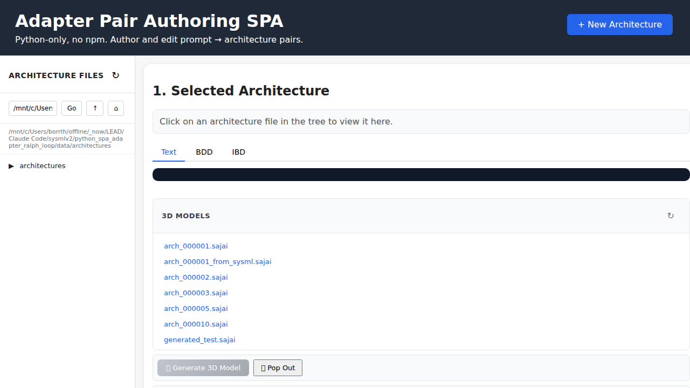
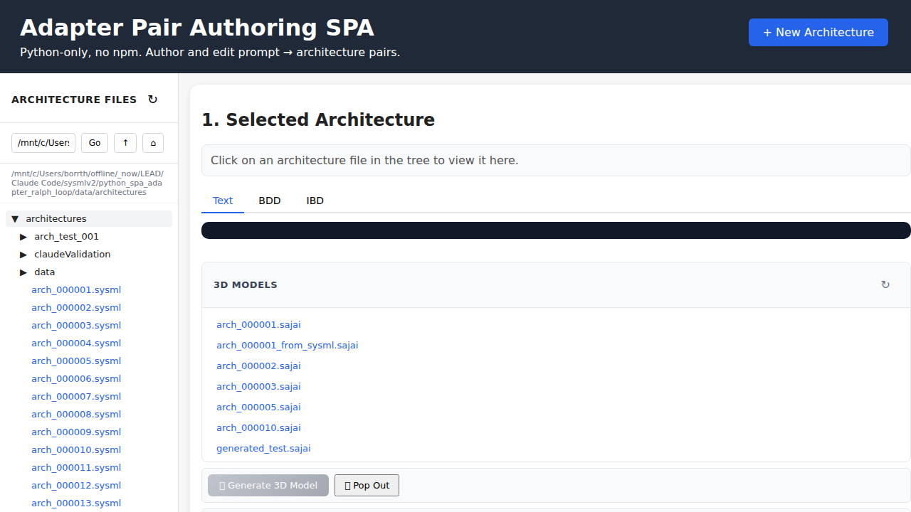
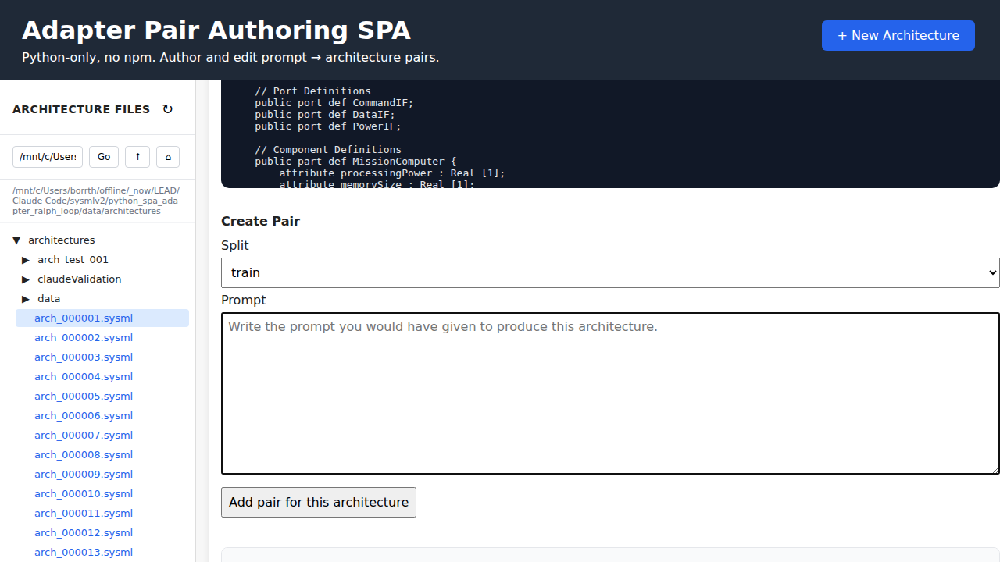
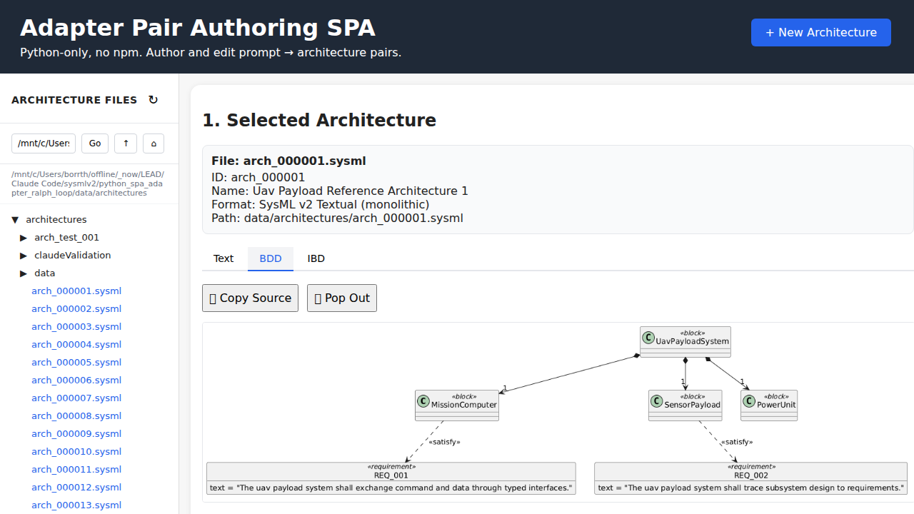
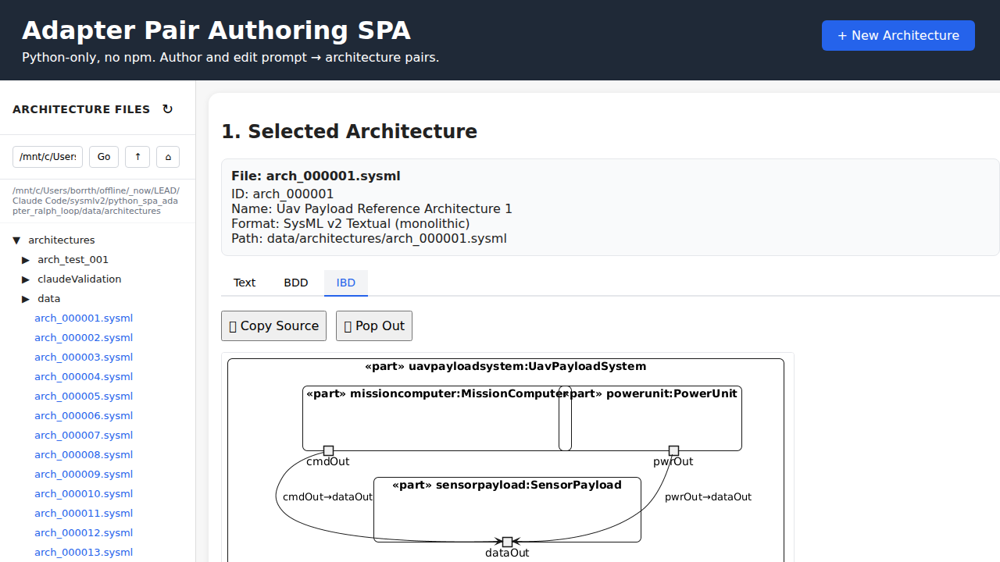
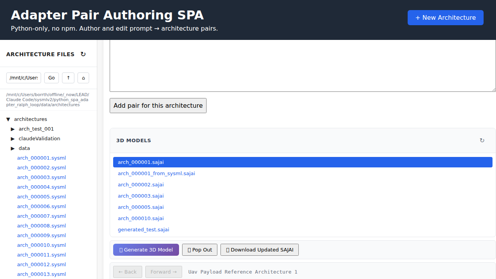

# SysML v2 Architecture Toolkit

A comprehensive toolkit for generating, visualizing, and validating SysML v2 architectures with an interactive web interface.

## 🎯 Overview

This project provides a complete pipeline for working with SysML v2 architectures:

```text
SysML Xtext Grammar
       ↓
   IR Generator
       ↓
    Renderer
       ↓
  .sysml (SysML v2 textual)
       ↓
   Validator
       ↓
  ┌────┴────┬─────────┐
  ↓         ↓         ↓
.glb/.sajai BDD      IBD
(3D model)  (diagram) (diagram)
```

**Pipeline Flow:**
1. **SysML Xtext** - Grammar-based IR generation
2. **Renderer** - Converts IR to valid SysML v2 textual notation
3. **Validator** - Validates syntax and semantics
4. **Multi-format output**:
   - **3D Models** - SAJAI/GLB format for Three.js visualization
   - **BDD Diagrams** - PlantUML Block Definition Diagrams
   - **IBD Diagrams** - PlantUML Internal Block Diagrams

## ✨ Features

### 📊 Interactive Web Interface

The Python SPA provides a modern interface for working with SysML v2 architectures:


*Landing page with file tree and interface overview*

### 📁 File Tree Navigation

Browse and select from 200+ generated architecture files:


*Hierarchical file tree with directory navigation*

### 📝 Text View

View and analyze the raw SysML v2 textual syntax:


*SysML v2 textual notation with syntax highlighting*

### 📐 Block Definition Diagram (BDD)

Visualize system structure and relationships:


*PlantUML-generated Block Definition Diagram*

### 🔗 Internal Block Diagram (IBD)

Explore internal connections and ports:


*PlantUML-generated Internal Block Diagram*

### 🎨 3D Visualization

Interactive 3D view of architecture models using SAJAI format:


*Three.js-powered 3D visualization with property inspector*

## 🚀 Quick Start

### Prerequisites

- Python 3.10+
- Node.js 18+ (for testing)
- Chrome/Chromium browser

### Installation

```bash
# 1. Clone the repository
git clone <repository-url>
cd sysmlv2

# 2. Start the web server
cd python_spa_adapter_ralph_loop
python3 spa/server.py --host 127.0.0.1 --port 8081
```

### Access the Interface

Open your browser to: http://127.0.0.1:8081

## 📦 Project Structure

```text
sysmlv2/
├── python_spa_adapter_ralph_loop/     # Main SPA application
│   ├── spa/                           # Web server and frontend
│   │   ├── server.py                  # Flask backend
│   │   ├── static/                    # Frontend assets
│   │   │   ├── index.html            # Main UI
│   │   │   ├── app.js                # Application logic
│   │   │   └── style.css             # Styling
│   │   └── sample-data/              # 3D models (.sajai)
│   ├── data/                         
│   │   └── architectures/            # SysML v2 files (.sysml)
│   ├── lib/                          # Core libraries
│   │   ├── ir_generator.py           # IR generation
│   │   ├── renderer.py               # SysML renderer
│   │   └── validator.py              # Validation
│   └── tests/                        # Test suites
│       └── playwright/               # E2E tests
├── scripts/                          # Utility scripts
├── docs/                            # Documentation
│   └── screenshots/                 # UI screenshots
└── output/                          # Generated files
```

## 🔧 Core Pipeline

### 1. Generate SysML v2 from Xtext Grammar

Generate intermediate representation and render to SysML v2:

```bash
# Generate IR from SysML Xtext grammar
python3 scripts/generate_ir.py --seed 42

# Render IR to SysML v2 textual notation
python3 scripts/render_ir.py input.ir.json output.sysml
```

### 2. Validate SysML v2

Validate syntax and semantics:

```bash
python3 scripts/validate_sysml.py architecture.sysml
```

### 3. Generate Visualizations from SysML v2

After validation, generate multiple output formats:

**3D Models (SAJAI/GLB):**
```bash
python3 lib/sysml_to_sajai.py architecture.sysml output.sajai
```

**Block Definition Diagram (BDD):**
```bash
python3 lib/generate_bdd.py architecture.sysml output_bdd.puml
```

**Internal Block Diagram (IBD):**
```bash
python3 lib/generate_ibd.py architecture.sysml output_ibd.puml
```

## 🧪 Testing

### Run Playwright Tests

```bash
cd python_spa_adapter_ralph_loop/tests/playwright
npx playwright test
```

**Current Test Results:** 76/82 passing (92.7%)

### Test Features

- ✅ File tree navigation (100% passing)
- ✅ Text tab display and interaction
- ✅ BDD diagram generation (80% passing)
- ✅ IBD diagram generation (82% passing)
- ✅ 3D view rendering (89% passing)
- ✅ End-to-end workflows (100% passing)

## 🛠️ Key Technologies

### Backend
- **Python 3.10+** - Core logic and server
- **Flask** - Web server
- **Jinja2** - Template rendering

### Frontend
- **Vanilla JavaScript** - No framework dependencies
- **Three.js** - 3D visualization
- **PlantUML** - Diagram generation

### Testing
- **Playwright** - E2E browser automation
- **pytest** - Python unit tests

## 📖 API Endpoints

### Architecture Management

- `GET /api/tree` - Get file tree
- `GET /api/architecture/<path>` - Load architecture file
- `POST /api/validate` - Validate SysML content

### Diagram Generation

- `GET /api/diagram/bdd/<path>` - Generate BDD diagram
- `GET /api/diagram/ibd/<path>` - Generate IBD diagram

### 3D Models

- `GET /api/sajai/tree` - List available 3D models
- `GET /api/sajai/<filename>` - Load SAJAI file
- `POST /api/sajai/generate` - Generate 3D from SysML

## 🎓 SysML v2 Resources

- [SysML v2 Specification](https://github.com/Systems-Modeling/SysML-v2-Release)
- [SysML v2 Pilot Implementation](https://github.com/Systems-Modeling/SysML-v2-Pilot-Implementation)
- [PlantUML SysML Support](https://plantuml.com/sysml)

## 🔒 Security

See [SECURITY.md](SECURITY.md) for security best practices and guidelines.

## 📊 Corpus Generation

Generate a corpus of valid/invalid architectures for training:

```bash
./scripts/generate_validate_corpus.sh --count 25 --seed 42
```

Output structure:
```text
output/
├── candidates/          # All generated files
├── valid/              # Validated architectures
│   ├── *.ir.json       # Intermediate representation
│   ├── *.sysml         # SysML textual notation
│   └── *.validation.json
├── invalid/            # Failed validations
└── corpus/             # Training datasets
    ├── train.jsonl
    └── repair.jsonl
```

## 🤝 Contributing

This project uses the Ralph loop for automated development with Claude Code:

```bash
# Run the Ralph loop
./ralph/mega_ralph.sh
```

The loop will:
1. Implement features from task specifications
2. Run acceptance checks
3. Feed back failures
4. Repair issues automatically
5. Repeat until all checks pass

## 📝 Design Principles

### Key Constraint

**Never generate raw SysML text directly.** Always use the grammar-driven pipeline:

```text
SysML Xtext → IR → Renderer → .sysml (validated) → Multi-format output
```

**Why this approach:**

1. **Grammar-driven generation** - SysML Xtext grammar ensures correctness
2. **IR as control surface** - Structured intermediate representation
3. **Validation checkpoint** - All .sysml files are validated before visualization
4. **Multi-format support** - Single .sysml source generates:
   - 3D models (.sajai/.glb)
   - BDD diagrams (PlantUML)
   - IBD diagrams (PlantUML)

**Benefits:**
- ✅ Consistent structure from grammar rules
- ✅ Validation before visualization
- ✅ Reproducible generation from IR
- ✅ Better debugging with intermediate artifacts
- ✅ Multiple visualization formats from one source

## 🎮 Interactive Development

### Playwright CLI

Use the playwright-cli skill for browser automation:

```bash
# Open the SPA
playwright-cli open http://127.0.0.1:8081 --browser=chromium --headed

# Take snapshots and interact
playwright-cli snapshot
playwright-cli click e15
playwright-cli screenshot --filename=test.png
```

See [PLAYWRIGHT_CLI_SETUP.md](PLAYWRIGHT_CLI_SETUP.md) for detailed setup.

## 📈 Project Status

- ✅ Core IR generation pipeline
- ✅ SysML v2 renderer
- ✅ Local validation
- ✅ Interactive web interface
- ✅ PlantUML diagram generation
- ✅ 3D visualization (SAJAI)
- ✅ E2E test suite (92.7% passing)
- 🔄 Remote validation API integration
- 🔄 XMI export functionality

## 📧 Support

For issues or questions:
1. Check existing documentation in `docs/`
2. Review [SECURITY.md](SECURITY.md) for security concerns
3. See [SAJAI.md](SAJAI.md) for 3D format details

---

**Built with Claude Code** - Automated development with AI assistance

Last Updated: 2026-05-31
